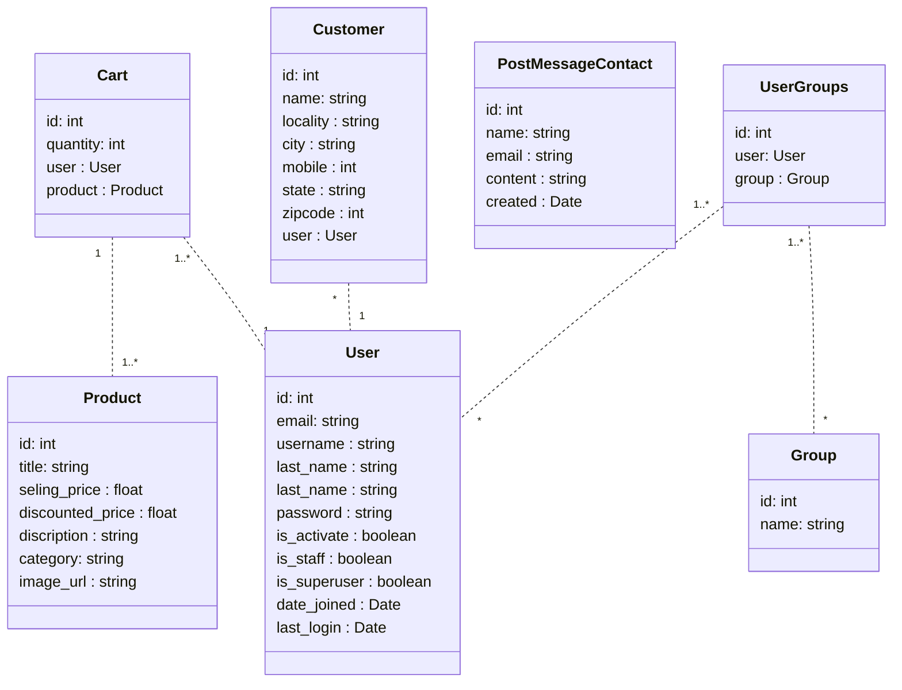

# IRY Tech :

## :bookmark_tabs: Description :

## :chains: Development :

### :hammer_and_wrench: Development Tools :

  &nbsp;
  &nbsp;
  &nbsp;
  &nbsp;
  &nbsp;
  &nbsp;
  &nbsp;
  &nbsp;
  &nbsp;
  &nbsp;
  &nbsp;
  &nbsp;

### :wrench: Class Diagram :

### :clipboard: Design :

### :gear: development :

### :computer: Application :

## :office: Conclusion :
